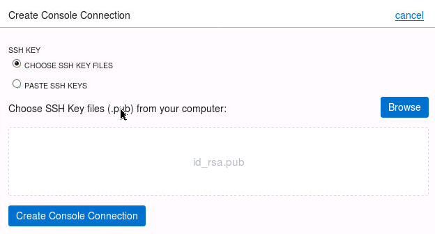
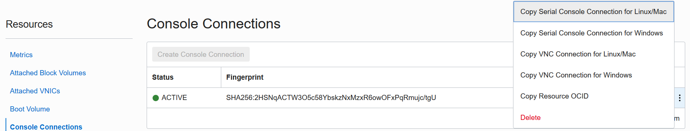
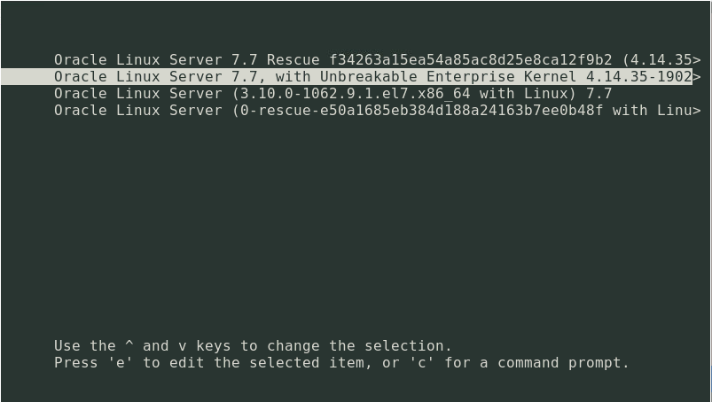
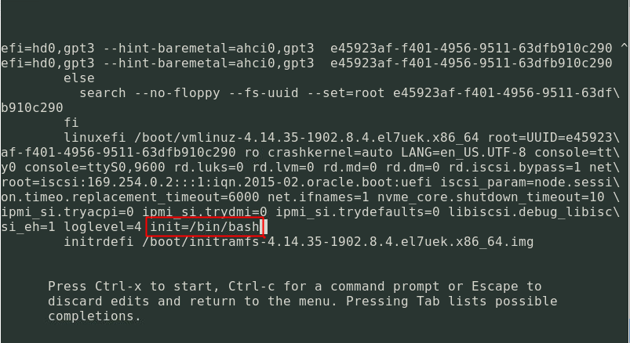
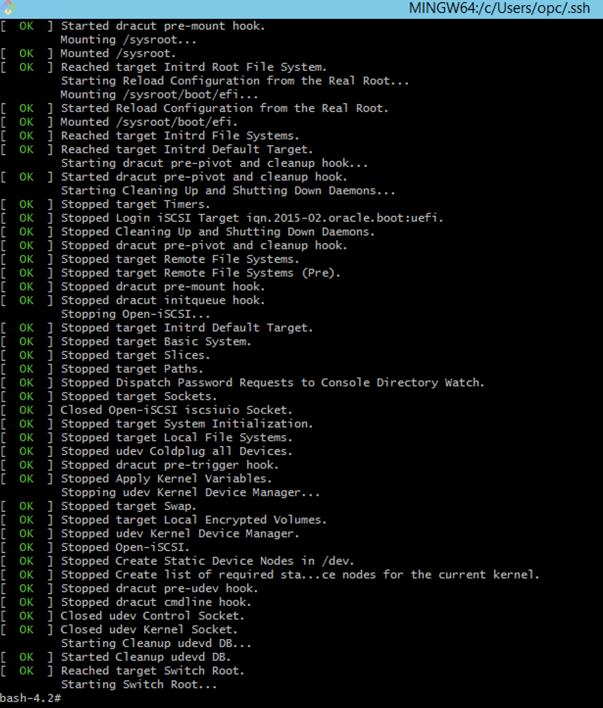

Practices for Lesson 4: Compute Console Connection 
==================================================

Practices for Lesson 4: Overview
--------------------------------

The Oracle Cloud Infrastructure Compute service provides console
connections that enable you to remotely troubleshoot malfunctioning
instances, such as:

-   An imported or customized image that does not complete a successful
    boot.

-   A previously working instance that stops responding.

There are two types of instance console connections:

-   Serial console connections

-   VNC console connections

#### Prerequisites

-   Oracle Cloud Infrastructure account credentials (User, Password, and
    Tenant)

-   URL for the Console: <https://console.us-ashburn-1.oraclecloud.com/>

-   Do NOT use compartment name and other data from screen shots. Only
    use data (including compartment name) as has been provided to you.

SSH key generation

If you already have a public/private key pair, you can use that for SSH.

**Note:** *Some of the UIs might look a little different than the screen
shots included in the instructions, but you can still use the
instructions to complete the hands-on labs*

Practice -1: Creating the Instance Console Connection
-----------------------------------------------------

### Overview

Before you can connect to the serial console, you need to create the
instance console connection.

### 

### Tasks

1.  Open the navigation menu. Under **Core Infrastructure**, go to
    **Compute** and click **Instances**.

2.  In the list of instances, find the Linux instance you want to access
    the serial console for, and then click the **instance name**.

3.  In the **Resources** section on the **Instance Details** page, click
    **Console Connections**, and then click **Create Console
    Connection**.  
    

4.  Add your public SSH key, either by browsing and selecting a public
    key file, for example id\_rsa.pub, or by pasting your public key
    into the text box.  
    

5.  Click **Create Console Connection** (Refresh the screen and you will
    see an Active Console Connection).

Practice 4-2: Create a new SSH key
----------------------------------

### Overview

In this practice you will create a new SSH key which we shall use later
in the practice.

### Tasks

1.  Generate new ssh-keys. This time provide details in which to save
    the key. **Do not** accept the default path and key file.

    Copy the contents of the file newkey.pub in a notepad for use in the
    practices ahead.

$ cat /home/oracle/.ssh/newkey.pub

Practice -3: Connecting to the Serial Console
---------------------------------------------

### Overview

Once you have created the console connection for the instance, you can
then connect to the serial console by using a Secure Shell (SSH)
connection. Once you are finished with the serial console and have
terminated the SSH connection, you should delete the serial console
connection. If you do not disconnect from the session, Oracle Cloud
Infrastructure will terminate the serial console session after 24 hours
and you will need to re-authenticate to connect again.

### Tasks

1.  On the **Instances Details** page, in the **Resources** section,
    click **Console Connections**.

2.  Click the Actions icon (three dots), and then click **Copy Serial
    Console Connection for Linux/Mac**  
    

3.  Paste the connection string copied from the previous step to the
    cloud shell prompt and hit enter to connect to the console.

4.  Hit **Enter** again to activate the console.

**Practice** **4-4: Boot your instance in Maintenance Mode**
------------------------------------------------------------

### Overview

Once you are connected with an instance console connection, you can
perform various tasks, such as:

-   Edit system configuration files.

-   Add or reset the SSH keys for the **opc** user.

Both of these tasks require you to boot into a bash shell, in
maintenance mode.

### Tasks

1.  Reboot the instance from the Console. In the Console, on the
    **Instances Details** page, click **Reboot**.

2.  Once the reboot process starts, switch back to the terminal, and you
    see console messages start to appear. As soon as you see the GRUB
    boot menu appear, use the **up/down arrow key** to stop the
    automatic boot process, enabling you to use the boot menu.

1.  In the boot menu, highlight the Unbreakable Enterprise Kernel Linux
    Server entry, and type **e** to edit the boot entry.

2.  In edit mode, use the **down arrow key to scroll down** through the
    entries until you reach the line that starts with either
    **linuxefi** for instances running Oracle Linux 7.x, or **kernel**
    for instances running Oracle Linux 6.x.

3.  At the end of that line, add: init=/bin/bash  
    

4.  Reboot the instance from the terminal window by entering the
    keyboard shortcut **CTRL+x**.

    

5.  Now your instance is on Maintenance Mode and you can replace your
    SSH.

Practice 4-5: Reset the SSH Key using Instance Console Connections
------------------------------------------------------------------

### Tasks

1.  From the Bash shell, run the following command to load the SELinux
    policies to preserve the context of the files you are modifying:

\# /usr/sbin/load\_policy -i

1.  Run the following command to remount the root partition with
    read/write permissions:

\# /bin/mount -o remount, rw /

\# su - opc

1.  From the Bash shell, run the following command to change to the SSH
    key directory for the opc user:

$ cd .ssh

1.  Rename the existing authorized keys file with the following command:

$ mv authorized\_keys authorized\_keys.old

1.  Copy the newkey.pub file saved on a notepad in the previous
    practice.

2.  Replace the contents of the public key file with the new public key
    file with the following command:

$ echo '&lt;paste contents of newkey.pub key file&gt;' &gt;&gt;
authorized\_keys

$ chmod 600 authorized\_keys

$ exit

1.  Restart the instance by running the following command:

\# /usr/sbin/reboot -f

1.  Now you can login to your instance using the new SSH key.
