# Create a VCN in OCI

## Launch a web browser and navigate  to <https://console.us-ashburn-1.oraclecloud.com/>  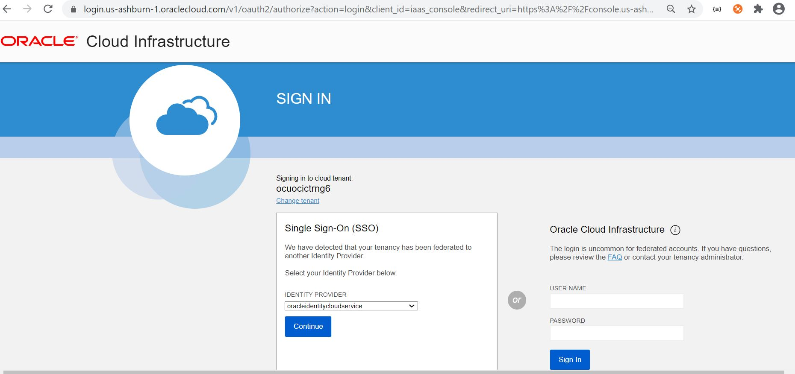

## On the sign in page, enter your account information, and click “Sign In” 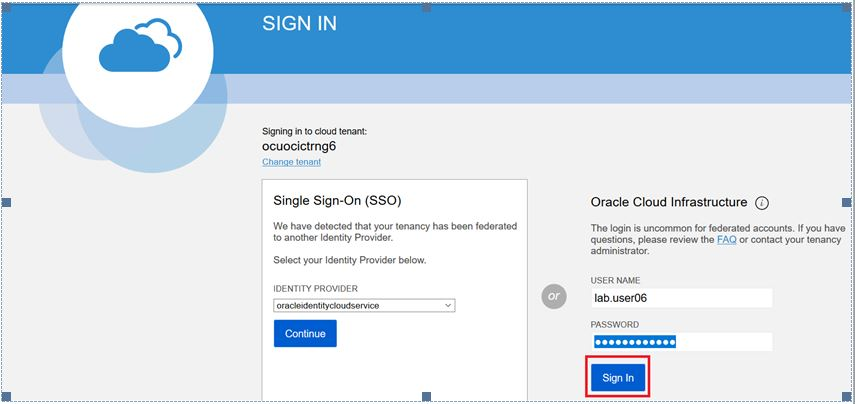

## Now, you are logged in to Oracle Cloud Infrastructure (OCI) Dashboard 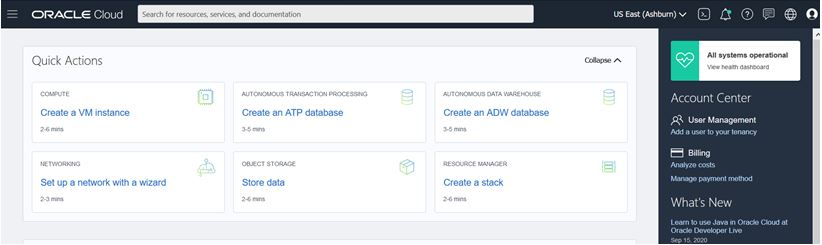

## In the web console, click Navigation Menu > Networking > Virtual Cloud Networks 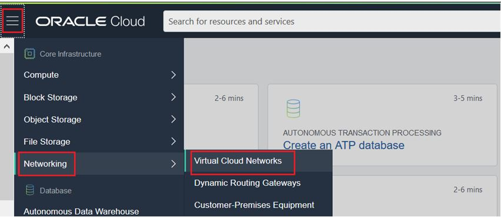

## In the networking page, select your compartment name from the drop-down list 

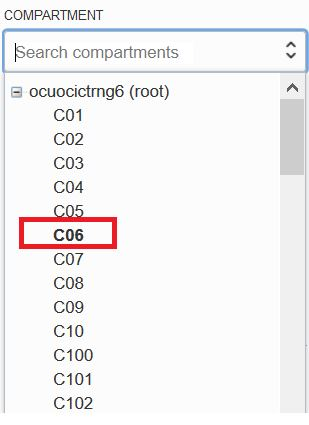

## On the Virtual Cloud Networks page, click Start VCN Wizard 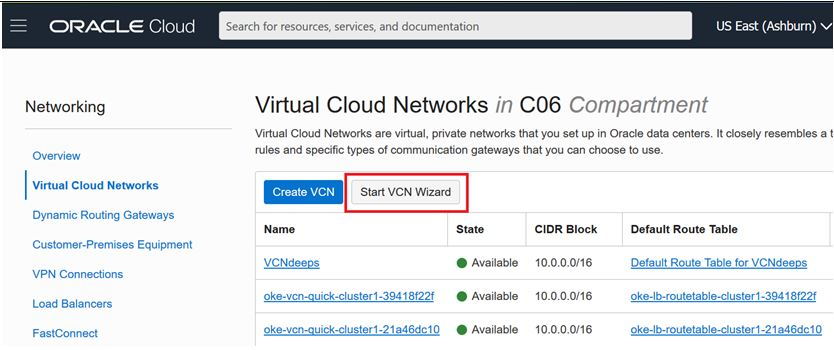

## In the dialog box, choose VCN with Internet Connectivity, and click Start VCN Wizard. 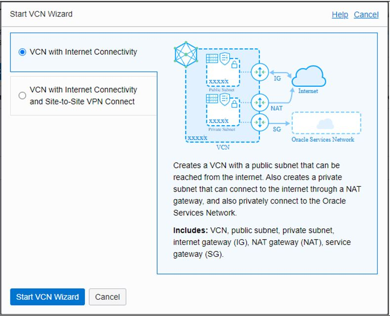

## Provide the basic information

## •VCN Name – ocilabs-network

## •Compartment – <your_compartment>

## •VCN CIDR Block – Enter 10.0.0.0/16

## •Public Subnet CIDR Block – Enter 10.0.1.0/24

## •Private Subnet CIDR Block – Enter 10.0.2.0/24

## •Select the check box for - Use DNS Hostnames in this VCN

## •Click Next

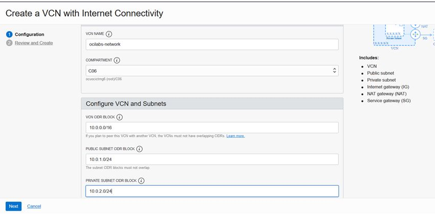

## Review and click Create  

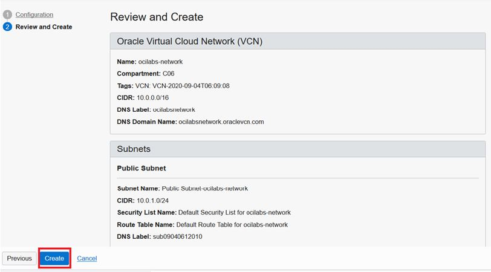

## The VCN is created along with Private and Public Subnets.

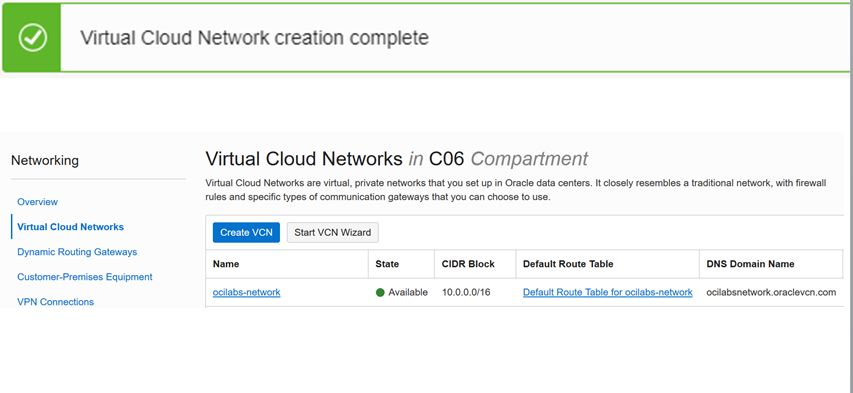

# Launch Cloud shell

1.  Click the **Cloud Shell icon** on the top right of the screen

2.  This will launch the Cloud Shell in a "drawer" at the bottom of the
    console

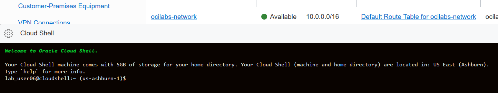

3.  Display the name space of your OCI tenant

**oci os ns get**

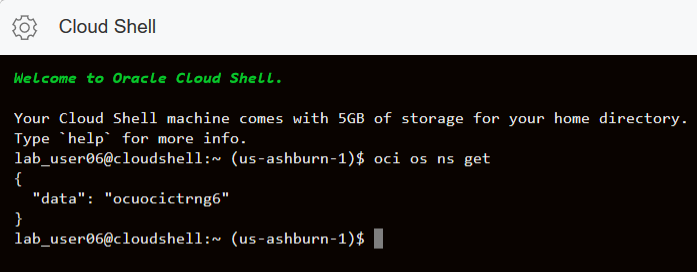
