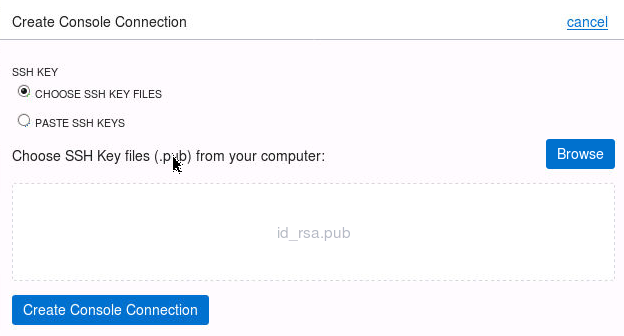

# Launch Cloud shell

1.  Click the **Cloud Shell icon** on the top right of the screen

2.  This will launch the Cloud Shell in a "drawer" at the bottom of the
    console

3.  Display the name space of your OCI tenant

**oci os ns get**

